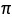

# libpi
`libpi` calculates an approximation of .

### Method
The approximation is done using [Nilakantha Series](https://en.wikipedia.org/wiki/Pi)

.

### Build
* `git clone git@github.com:mathinjenkins/libpi.git`
* `cd libpi`
* `mkdir build && cd build`
* `cmake ../`
* `make`
* `./test/pi_test`

### License
[MIT License](https://github.com/mathinjenkins/libpi/blob/master/LICENSE)
